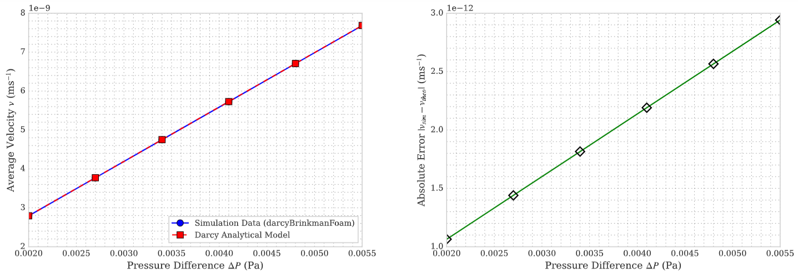

# darcyBrinkmanFoam

## Application
`darcyBrinkmanFoam`

## Group
`grpIncompressible PorousMedia Solvers`

## Description
`darcyBrinkmanFoam` é um solver **transiente** para escoamento **incompressível, laminar** de fluidos Newtonianos através de **meios porosos**.


O solver utiliza o algoritmo **PISO** para resolver a equação de Darcy–Brinkman.

---

## 🔹 Equações Governantes

### Continuidade


### Quantidade de Movimento


## 🔹 Notação

| Símbolo   | Significado                        |
|-----------|------------------------------------|
| $\vec{U}$ | Velocidade                         |
| $p$       | Pressão cinemática, $p/\rho$       |
| $\nu$     | Viscosidade cinemática             |
| $K$       | Permeabilidade do meio poroso      |

---


## Resultado


O solver customizado `darcyBrinkmanFoam`, que incorpora o termo de Darcy, foi implementado.  
Uma análise de **pressão versus vazão** foi conduzida utilizando a malha validada para a geometria simplificada.  
Utilizamos \(K = 75.6\)\,D.  

Os resultados comparados com a **lei de Darcy** apresentaram erro **< 0.5%**.  
Um leve aumento na discrepância para maiores \(\Delta P\) pode indicar **efeitos de Brinkman** modestos.



## 🚀 Como compilar

Dentro da pasta do solver:
```bash
wclean && wmake

